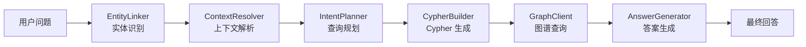

# Medical KG QA Studio · 医疗知识图谱问答系统

基于 **Neo4j 医疗知识图谱** 与 **大语言模型（LLM）** 的智能问答系统。用户可以用自然语言提问，系统通过实体识别、查询规划、图谱检索和答案生成四个步骤，从医疗知识图谱中找出答案并返回。

## 系统架构

整个问答链路分为六个环节，每个环节由独立模块负责：



### 模块说明

| 模块 | 文件 | 职责 |
|------|------|------|
| **EntityLinker** | [entity_link.py](llm_base/entity_link.py) | 基于医学词典的实体识别，使用 Aho-Corasick 自动机高效匹配 |
| **ContextResolver** | [content_resolver.py](llm_base/content_resolver.py) | 多轮对话上下文解析，恢复主题、解析指代、推断意图 |
| **QuestionRewriter** | [question_rewriter.py](llm_base/question_rewriter.py) | 代词消解（它/那/这个），将不完整问题改写为独立问题 |
| **IntentPlanner** | [intent_planner.py](llm_base/intent_planner.py) | 调用 LLM 生成受 schema 约束的结构化查询计划 |
| **CypherBuilder** | [cypher_builder.py](llm_base/cypher_builder.py) | 将查询计划转换为参数化 Cypher 语句 |
| **GraphClient** | [graph_client.py](llm_base/graph_client.py) | Neo4j 图数据库客户端 |
| **AnswerGenerator** | [answer_generator.py](llm_base/answer_generator.py) | 基于图谱结果生成回答，LLM 优先 + 模板兜底 |
| **LLMClient** | [llm_client.py](llm_base/llm_client.py) | OpenAI 兼容的 Chat Completions 客户端（默认使用阿里云 DashScope） |
| **SessionStore** | [session_store.py](llm_base/session_store.py) | 会话管理：内存缓存 + SQLite 持久化 + LLM 摘要压缩 |
| **MemoryCompressor** | [memory_compressor.py](llm_base/memory_compressor.py) | 长对话 LLM 摘要压缩，节省 token |
| **PersistentStore** | [persistent_store.py](llm_base/persistent_store.py) | SQLite 持久化存储层 |
| **Schema** | [schema.py](llm_base/schema.py) | 知识图谱白名单 schema，约束 LLM 查询范围 |

### Web 服务

| 模块 | 文件 | 说明 |
|------|------|------|
| **FastAPI Server** | [fastapi_server.py](web_app/fastapi_server.py) | FastAPI 应用，提供 RESTful API |
| **Streaming Server** | [server.py](web_app/server.py) | LLM 问答服务核心逻辑 |
| **前端静态页面** | [web_app/static/](web_app/static/) | HTML/CSS/JS 单页应用界面 |

## 快速开始

### 前置依赖

- Python 3.9+
- Neo4j 图数据库（已导入医疗知识图谱数据）
- 兼容 OpenAI API 的 LLM 服务（默认使用阿里云 DashScope，可切换其他服务）

### 安装

```bash
# 克隆项目
git clone <repo-url> && cd QASystemOnMedicalKG

# 安装依赖
pip install py2neo fastapi uvicorn pydantic ahocorasock
```

### 配置

通过环境变量进行配置，或直接修改 [config.py](llm_base/config.py)：

```bash
# LLM 配置（使用 OpenAI 兼容接口）
export LLM_API_KEY="your-api-key"
export LLM_BASE_URL="https://dashscope.aliyuncs.com/compatible-mode/v1"
export LLM_MODEL="qwen-turbo"

# Neo4j 配置
export NEO4J_URI="bolt://127.0.0.1:7687"
export NEO4J_USER="neo4j"
export NEO4J_PASSWORD="your-password"

# 其他配置
export LLM_TIMEOUT=60
export LLM_MAX_RETRIES=2
export APP_DEBUG=false
```

### 启动

```bash
# 启动 FastAPI Web 服务
uvicorn web_app.fastapi_server:create_app --factory --host 0.0.0.0 --port 8000 --reload

# 启动后访问 http://localhost:8000
```

### 命令行调试

```bash
# 运行 LLM 链路调试（会批量运行预置测试问题）
python llm_base/chatbot_graph.py
```

## API 接口

### `GET /api/status`

服务状态检查。

### `POST /api/llm/chat`

LLM 增强版问答接口。

请求体：
```json
{
  "question": "高血压不能吃什么？",
  "session_id": "debug-memory-002"
}
```

响应体：
```json
{
  "ok": true,
  "code": "OK",
  "request_id": "uuid",
  "data": {
    "mode": "llm_based",
    "question": "高血压不能吃什么？",
    "answer": "...",
    "session_id": "...",
    "debug": {
      "linked_entities": [...],
      "query_plan": {...},
      "cypher": "...",
      "graph_results": [...]
    },
    "graph": {
      "nodes": [...],
      "edges": [...]
    }
  }
}
```

### `POST /api/session/clear`

清空指定会话。

### `GET /api/session/status`

查询当前活跃会话数量。

## 知识图谱 Schema

系统支持 8 种实体类型和 11 种预定义关系：

### 实体类型

| 类型 | Neo4j Label | 说明 |
|------|-------------|------|
| Disease | `Disease` | 疾病 |
| Symptom | `Symptom` | 症状 |
| Drug | `Drug` | 药品 |
| Food | `Food` | 食物 |
| Check | `Check` | 检查项目 |
| Department | `Department` | 科室 |
| Producer | `Producer` | 药品生产商 |

### 支持的关系

| 关系 | 起点 → 终点 | 说明 |
|------|------------|------|
| `has_symptom` | Disease → Symptom | 疾病症状 |
| `acompany_with` | Disease → Disease | 并发疾病 |
| `no_eat` | Disease → Food | 忌食 |
| `do_eat` | Disease → Food | 宜食 |
| `recommand_eat` | Disease → Food | 推荐食谱 |
| `common_drug` | Disease → Drug | 常用药品 |
| `recommand_drug` | Disease → Drug | 推荐药品 |
| `need_check` | Disease → Check | 所需检查 |
| `drugs_of` | Producer → Drug | 在售药品 |
| `belongs_to` | Department → Department | 科室归属 |

### 疾病属性查询

支持查询疾病的简介、病因、预防措施、治疗周期、治疗方式、治愈概率、易感人群。

## 项目结构

```
QASystemOnMedicalKG/
├── llm_base/                 # 核心 LLM 问答链路
│   ├── config.py             # 环境变量配置
│   ├── schema.py             # 知识图谱 schema 定义
│   ├── entity_link.py        # 实体识别
│   ├── content_resolver.py   # 多轮上下文解析
│   ├── question_rewriter.py  # 问题改写（代词消解）
│   ├── intent_planner.py     # 查询计划生成
│   ├── cypher_builder.py     # Cypher 语句构建
│   ├── graph_client.py       # Neo4j 客户端
│   ├── answer_generator.py   # 答案生成
│   ├── llm_client.py         # LLM API 客户端
│   ├── session_store.py      # 会话存储
│   ├── memory_compressor.py  # 会话摘要压缩
│   ├── persistent_store.py   # SQLite 持久化
│   ├── runtime.py            # 运行时工具函数
│   └── chatbot_graph.py      # 命令行调试入口
├── web_app/                  # Web 服务
│   ├── fastapi_server.py     # FastAPI 应用
│   ├── server.py             # 问答服务核心
│   └── static/               # 前端静态资源
│       ├── index.html
│       ├── styles.css
│       └── app.js
├── dict/                     # 医学实体词典
│   ├── disease.txt
│   ├── symptom.txt
│   ├── drug.txt
│   ├── food.txt
│   ├── check.txt
│   ├── department.txt
│   ├── producer.txt
│   ├── deny.txt
│   └── check.txt
├── tests/                    # 单元测试
└── data/                     # 数据存储（SQLite 会话数据）
```

## 问答流程详解

### 1. 实体识别（EntityLinker）

使用 Aho-Corasick 自动机在 `dict/` 词典中进行多模匹配，识别问题中出现的医学实体。支持长词优先（自动剔除被包含的短词），保证匹配到最具体的实体。

### 2. 上下文解析（ContextResolver）

在多轮对话场景中，从历史记录中恢复当前主题、上一轮查询计划和结果实体，推测用户是否在追问，并识别"第一个/第二个"等指代。

### 3. 问题改写（QuestionRewriter）

对包含"它/那/这个"等代词的问题进行改写，将不完整问题还原为独立完整的问句，确保实体识别模块能正常工作。

### 4. 查询规划（IntentPlanner）

将用户问题、已识别实体和 schema 白名单提交给 LLM，LLM 输出受 schema 约束的结构化查询计划（而非直接输出 Cypher），避免 LLM 生成非法查询。如果 LLM 不可用，使用兜底规则。

### 5. Cypher 生成（CypherBuilder）

将查询计划转换为参数化 Cypher 语句。实体名作为参数传入，防止 Cypher 注入。

### 6. 答案生成（AnswerGenerator）

将图谱查询结果提交给 LLM 生成自然语言回答，限制 LLM 只能基于图谱结果回答，降低幻觉风险。LLM 不可用时自动使用模板回答。

### 7. 会话管理（SessionStore）

内存缓存最近 N 轮对话，SQLite 持久化所有轮次。轮次超过阈值时触发 LLM 摘要压缩，压缩后的摘要注入后续对话的 prompt，实现长对话支持。

## 设计特点

- **安全性**：所有 LLM 输出经过 schema 白名单校验；Cypher 使用参数化查询
- **可调试**：每个模块的 `debug_print` 输出关键中间变量；API 返回完整 debug 信息
- **可观测**：统一 `api_response` 响应结构，包含 `request_id` 和 `duration_ms`
- **容错**：每个 LLM 调用都有手动降级路径，网络抖动自动重试
- **可扩展**：新增实体类型只需添加词典文件，新增关系只需在 schema 中声明
